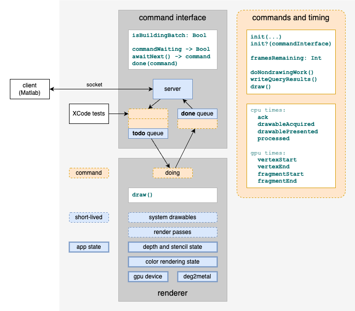

# Mgl Metal App and Commands

This readme describes the design of the Mgl Metal App, with a focus on commands.
Commands are objects that the app is able to receive, enqueue, process / render, and report on.

Here's a visual overview.

## Components

Here are descriptions of the components involved in processing Mgl Metal commands.

### client (Matlab)

The client is a separate application (Matlab) which connectes to the Mgl Metal app via a socket.
The client controls Mgl Metal by sending commands as formatted bytes.
It receives status and timing results back Mgl Metal as formatted bytes.

During development, Mgl Metal can also be driven by XCode tests.
These can drive Mgl Metal with formatted bytes, like the Matlab client, or by passing and inspecting command objects directly in memory.

### command interface

The Mgl Metal [command interface](metal/mglMetal/mglCommandInterface.swift) uses a [socket server](metal/mglMetal/mglServer.swift) to receive formatted bytes from the client.
Based on specific [command codes](metal/mglMetal/mglCommandTypes.h) received, it instantiates command objects and adds these to its **todo** queue for processing.

The command interface also takes processed commands from its **done** queue and writes timing and other results to the socket for the client to read.

The command interface doesn't know the details of any particular command, or how these get processed / rendered.
Instead, it lets the renderer component (below) do the processing.  It exposes the **todo** and **done** queues to the renderer via its `next()` and `done()` methods.

### renderer

The Mgl Metal [renderer](metal/mglMetal/mglRenderer2.swift) takes one command at a time from the command interface (above) and processes it.  Processing a command can include getting or setting the state of the Mgl Metal app itself, and/or rendering graphics.

The renderer manages short-lived system resources for each frame including:

 - the system's [drawable](https://developer.apple.com/documentation/quartzcore/cametaldrawable) for displaying a frame of graphics
 - a [render pass](https://developer.apple.com/documentation/metal/render_passes) for instructing the GPU what to render

The renderer also manages its own long-lived state including:

 - [depth and stencil state](metal/mglMetal/mglDepthStencilConfig.swift) for stencils being created or applied
 - [color rendering state](metal/mglMetal/mglColorRenderingConfig.swift) for the onscreen pixel format, custom textures, and onscreen vs offscreen rendering targets
 - the `deg2metal` coordinate transform matrix applied to rendered scenes
 - the system's GPU device

The renderer doesn't know the details of any particular command or how these get created.  Instead, it takes each command from the command interface using `next()`, processes it, and returns it to the command interface using `done()`.  During processing it calls standard methods on each command, at the appropriate times: `doNondrawingWork()` and `draw()`.  These methods are declared in the Mgl Metal command model (below) which provides a consistent interface over various command-specific behaviors.

### command model

The Mgl Metal [command model](metal/mglMetal/mglCommandModel.swift) is an abstraction that covers all commands, allowing them to fit a common shape expected by the command interface and the renderer.  Within this model, each command is free to manage its own details.  Mgl Metal has many specific command [implementations](https://github.com/justingardner/mgl/tree/commandModel/metal/mglMetal/commands) for different tasks.

Once a command object is read from the socket and initialized it is considered ready for processing, either immediately or at a later time.  This means each command must store its own parameters and data.  usually this means reading command-specific values from the command interface as part of a command's `init?()` method.  Some commands will also write data to GPU buffers during `init()?`, and store references the buffers.

During processing, the renderer will call two standard methods of each command:
 - `doNondrawingWork()` is a chance for the command to get or set the state of the Mgl Metal app.  It can also store any command-specific results it wants to return to the client.
 - `draw()` is a chance to encode Metal rendering commands as part of a render pass.

After processing, the command interface will call one other standard method of each command:
 - `writeQueryResults()` is a chance for the command to write any command-specific results it wants to return to the client.

## Lifecycle of a Command

Here's sequential walkthrough of how a command moves through the app.

### 1. initialized from client bytes

A command starts when a connected client sends a [command code](metal/mglMetal/mglCommandTypes.h) to the socket server.
The command interface reads this code and sends back an **ack** timestamp to the client.
Based on the specific command code the command interface chooses a command implementation and calls its `init?()` method, to obtain a new command object.

Here are some examples of command initialization and `init?()` implementations:

 - [mglFlushCommand](metal/mglMetal/commands/mglFlushCommand.swift) requires no parameters or other data and initializes unconditionally.
 - [mglSetClearColorCommand](metal/mglMetal/commands/mglSetClearColorCommand.swift) requires a color paramter.  It attempts to read this color from the command interface and stores the result in one of its own fields.
 - [mglDotsCommand](metal/mglMetal/commands/mglDotsCommand.swift) requires vertex data.  It attempts to read a vertex array from the command interface and stores the result directly to a GPU device buffer.

Once initialized commands are considered complete and ready for processing, either immediately or at a later time.

### 2. added to **todo**

The command interface adds initialized commands to its **todo** queue.
From here they are processed by the renderer in the order they arrived.
This usually happens right away, before the **todo** queue has a chance to grow.

The command interface also supports command batches, where the **todo** queue is allowed to fill up with multiple fully initialized commands, before allowing the renderer to start processing them.

### 3. processed

The renderer will process each next available command from the command interface's **todo** queue.
This happens periodically when the system invokes the renderer's `draw()` method.

Processing starts with a call to each command's `doNondrawingWork()`.
This is a chance for the command to get or set the state of the Mgl Metal app and remember any command-specific results it wants to return to the client.

Here are some examples of non-drawing work:

 - [mglSetClearColorCommand](metal/mglMetal/commands/mglSetClearColorCommand.swift) updates the clear color of the app's Metal View, to be applied to the next rendering pass.
 - [mglCreateTextureCommand](metal/mglMetal/commands/mglCreateTextureCommand.swift) initializes a new Metal texture and remembers its new texture number, to return to the client.
 - [mglDotsCommand](metal/mglMetal/commands/mglDotsCommand.swift) uses the default no-op, since it's only interested in drawing (below).

Some commands will be complete here.  Others will also want to draw graphics.  When the renderer gets a drawing command it will set up a Metal render pass and enter a tight loop to receive additional commands that should `draw()` into the same frame.  Each of these commands will have `doNondrawingWork()` and `draw()` called before being added to the command interface's **done** queue.

Here are some drawing examples:

 - [mglDotsCommand](metal/mglMetal/commands/mglDotsCommand.swift) encodes Metal commands for the current render pass in order to send its vertex data through the Mgl Metal "dots" shaders.
 - [mglSetClearColorCommand](metal/mglMetal/commands/mglSetClearColorCommand.swift) and [mglCreateTextureCommand](metal/mglMetal/commands/mglCreateTextureCommand.swift) use the default no-op `draw()` implementation.  These can be used during a rendering tight loop to modify the state of the app, but they won't draw anything.
 - [mglFlushCommand](metal/mglMetal/commands/mglFlushCommand.swift) is a special case that tells the app to exit the drawing tight loop, end the rendering pass, and present the current frame.

### 4. added to **done**

After processing, the renderer gives each command back to the command interface and its **done** queue.
From here, the command interface will send command-specifc and standard results back to the client, in the same order that the commands arrived.
This usually happens right away, before the **done** queue has a chance to grow.

The command interface also supports command batches, where the **done** queue is allowed to fill up with multiple completed commands, until the client requests them.  This keeps the socket quiet during batch processing.

### 5. reported as bytes to client

Each **done** command is reported back to the client including:
 - optional, command-specific data
 - a standard record of status and timing

First, the command interface calls a command's `writeQueryResults()` method to send optional, command-specific data.  Here are some examples of command-specific query results:

 - [mglCreateTextureCommand](metal/mglMetal/commands/mglCreateTextureCommand.swift) writes the new texture number of its new texture to the command interface.
 - [mglReadTextureCommand](metal/mglMetal/commands/mglReadTextureCommand.swift) does a sanity check to see if it has texture image data to report.  If not, it writes a negative "heads up" to the client indicating that no image data will follow.  Otherwise, it writes a positive "heads up" followed by image data.
 - [mglDotsCommand](metal/mglMetal/commands/mglDotsCommand.swift) uses the default-no-op since it has no command-specific results to report to the client.

Finally, the command interface writes a standard record of staus and timing for each command.  These results are gathered automatically by the command interface and the renderer and assigned to commands wherever applicable and available.  They include:

 - `commandCode` to echo back to the client
 - `success` true or false, wheter the command processed successfully
 - `ackTime` CPU time when the command was received
 - `processedTime` CPU time when the command was done
 - `vertexStart` GPU time when the render pipeline vertex stage began (for flush commands)
 - `vertexEnd` GPU time when the render pipeline vertex stage finished (for flush commands)
 - `fragmentStart` GPU time when the render pipeline fragment stage began (for flush commands)
 - `fragmentEnd` GPU time when the render pipeline fragment stage finished (for flush commands)
 - `drawableAcquired` CPU time when Mgl Metal got hold of the system drawable for a frame (for flush and drawing commands)
 - `drawablePresented` CPU time when the system presented the drawable for the previous frame (for flush commands)

The Matlab client expects all these fields to be reported for each command and reads the results with [mglReadCommandResults](mgllib/mglReadCommandResults.m).

Once a command has been reported back to the client, it ends and goes away.
