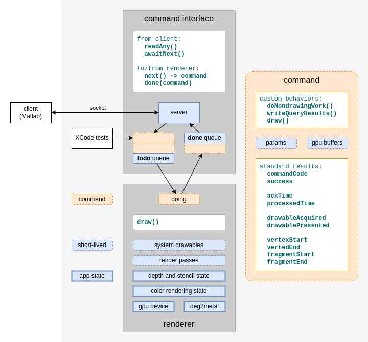

# Mgl Metal App and Commands

This readme describes the design of the Mgl Metal App, with a focus on commands.
Commands are objects that the app is able to receive, enqueue, process / render, and report on.

Here's a visual overview.

## Components

Here's a description of each component Mgl Metal uses to process commands.

### client (Matlab)

The client is a separate application (Matlab) which connectes to the Mgl Metal app via a socket.
The client controls Mgl Metal by sending commands as formatted bytes and receives timing and other results back from the Mgl Metal as formatted bytes.

During development, Mgl Metal can also be driven by XCode tests.
These can send and receive formatted bytes like the Matlab client does.
The can also invoke commands and inspect their results directly in memory.

### command interface

The Mgl Metal [command interface](metal/mglMetal/mglCommandInterface.swift) uses a [socket server](metal/mglMetal/mglServer.swift) to receive formatted bytes from the client.
Based on specific [command codes](metal/mglMetal/mglCommandTypes.h) received, it instantiates command objects and adds these to its **todo** queue for processing.

The command interface also takes processed commands from its **done** queue and writes timing and other results to the socket for the client to read.

The command interface doesn't know the details of any particular command, or how these get processed / rendered.
Instead, it lets the renderer component (below) do the processing.  It exposes the **todo** and **done** queues to the renderer via its ``awaitNext()`` and `done()` methods.

### renderer

The Mgl Metal [renderer](metal/mglMetal/mglRenderer2.swift) takes one command at a time from the command interface (above) and processes it.  Processing a command can include getting or setting the state of the Mgl Metal app itself, and/or rendering graphics.

The renderer manages short-lived system resources for each frame including:

 - the system's [drawable](https://developer.apple.com/documentation/quartzcore/cametaldrawable)
 - a [render pass](https://developer.apple.com/documentation/metal/render_passes)

The renderer also manages its own long-lived state including:

 - [depth and stencil state](metal/mglMetal/mglDepthStencilConfig.swift) for stencils being created or applied
 - [color rendering state](metal/mglMetal/mglColorRenderingConfig.swift) for the onscreen pixel format, custom textures, and onscreen vs offscreen rendering targets
 - the `deg2metal` coordinate transform matrix applied to rendered scenes
 - the system's gpu device

The renderer doesn't know the details of any particular command or how these get created.  Instead, it takes commands from the command interface using `awaitNext()`, processes each one, and returns them to the command interface using `done()`.  During processing it relies on an abstract command model (below) and calls the standard methods `doNondrawingWork()` and `draw()` on each command.

### command model

The Mgl Metal [command model](metal/mglMetal/mglCommandModel.swift) is an abstraction that covers all commands, allowing them to fit a common shape expected by the command interface and the renderer.  Within this model, each command is free to manage its own details.  Mgl Metal has many specific command [implementations](https://github.com/justingardner/mgl/tree/commandModel/metal/mglMetal/commands) for different tasks.

Once a command object is initialized it is considered ready for processing, either immediately or at a later time.  This means each command must store its own parameters and data (or references to stored data).  Often this means reading command-specific values from the command interface as part of a command's `init?()` method.

In addition, every command has a `framesRemaining` field which determines whether or not the command should be added to a rendering pass.  Simple get and set commands have `framesRemaining` <= 0 and are processed one at a time without rendering.  Frames with one or more `framesRemaining` are added to a render pass.

During processing, the renderer will call two standard methods of each command:
 - `doNondrawingWork()` is a chance for the command to get or set the state of the Mgl Metal app and store any results it wants to return to the client.
 - `draw()` is a chance to get draw as part of a Metal render pass.

After processing, the command interface will call one other standard method of each command:
 - `writeQueryResults()` is a chance for the command to write any command-specific results for return to the client.

## Lifecycle of a Command

Here's sequential walkthrough of how a command moves through the app.

### 1. initialized from client bytes

A command starts when a connected client sends a [command code](metal/mglMetal/mglCommandTypes.h) to the socket server.
The command interface reads this code and sends back an **ack** timestamp to the client.
Then, based on the specific command code, the command interface chooses a command implementation and calls its `init?()` method to obtain a new command object.

Here are some examples of command initialization:

 - [mglFlushCommand](metal/mglMetal/commands/mglFlushCommand.swift) requires no parameters or other data.  It initializes unconditionally with one `framesRemaining` to make it part of a render pass.
 - [mglSetClearColorCommand](metal/mglMetal/commands/mglSetClearColorCommand.swift) requires a color paramter.  It attempts to read this color from the command interface and stores the result in one of its own fields.
 - [mglDotsCommand](metal/mglMetal/commands/mglDotsCommand.swift) requires vertex data.  It attempts to read a vertex array from the command interface and stores the result directly to a gpu device buffer.

Once initialized, commands are considered complete and ready for processing.

### 2. added to **todo**

The command interface adds initialized commands to its **todo** queue.
From here they are processed by the renderer in the order they arrived.
This usually happens right away, before the queue has a chance to grow.

If the client has requested a batch of commands the command interface will hide queued commands from the renderer, allowing the **todo** queue to grow.
Once the client releases the batch the renderer will see commands again and be able to work through the queue.

### 3. processed

The renderer will process each next available command from the command interface's **todo** queue.
This happens periodically when the system invokes the renderer's `draw()` method.

Processing starts with a call to each command's `doNondrawingWork()`.
This is a chance for the command to get or set the state of the Mgl Metal app and remember any results it wants to return to the client.

Here are some examples of non-drawing work:

 - [mglSetClearColorCommand](metal/mglMetal/commands/mglSetClearColorCommand.swift) updates the clear color of the app's Metal View, to be applied to the next rendering pass.
 - [mglCreateTextureCommand](metal/mglMetal/commands/mglCreateTextureCommand.swift) initializes a new Metal texture and remembers the new texture number for this texture.
 - [mglDotsCommand](metal/mglMetal/commands/mglDotsCommand.swift) uses the default no-op, since it's only interested in drawing (below).

Processing of simple get and set commands, with `framesRemaining` <= 0, stops here.  These commands will be added to the command interface's **done** queue right away with no rendering.

For drawing commands, with at least one `framesRemaining`, the renderer will set up a Metal render pass, and enter a tight loop to receive additional commands that should draw into the same frame.  Each of these commands will have its `doNondrawingWork()` and `draw()` methods called, have its `framesRemaining` value decremented, and be added to the command interface's **done** queue.

Here are some draw examples:

 - [mglDotsCommand](metal/mglMetal/commands/mglDotsCommand.swift) encodes Metal commands for the current render pass in order to send its vertex data through the Mgl Metal "dots" shaders.
 - [mglSetClearColorCommand](metal/mglMetal/commands/mglSetClearColorCommand.swift) and [mglCreateTextureCommand](metal/mglMetal/commands/mglCreateTextureCommand.swift) use the default no-op `draw()` implementation.  These can be used during a rendering tight loop, but they won't draw anything.
 - [mglFlushCommand](metal/mglMetal/commands/mglFlushCommand.swift) is a special case that tells the app to exit the tight loop, end the rendering pass, and present the current frame.

### 4. added to **done**

After processing, the renderer gives each command back to the command interface and its **done** queue.
From here, the command interface sends each command's requested results and timing data back to the client, in the same order that the commands arrived.
This usually happens right away, before the queue has a chance to grow.

If the client has requested a batch of commands, the command interface will hold **done** command results until the client requests them, allowing the **done** queue to grow.  This keeps the socket quiet during batch execution.

### 5. reported as bytes to client

Each **done** command is reported back to the client including:
 - optional, command-specific data
 - a standard set of timestamps

First, the command interface calls a command's `writeQueryResults()` method to send optional, command-specific data.  Here are some examples of command-specific query results:

 - [mglCreateTextureCommand](metal/mglMetal/commands/mglCreateTextureCommand.swift) writes the new texture number of the texture it created to the command interface.
 - [mglReadTextureCommand](metal/mglMetal/commands/mglReadTextureCommand.swift) does a sanity check to see if it has texture image data to report.  If not, it writes a negative "heads up" to the client indicating that no image data will follow.  Otherwise, it writes a positive "heads up" followed by image data.
 - [mglDotsCommand](metal/mglMetal/commands/mglDotsCommand.swift) uses the default-no-op since it has no command-specific results to report to the client.

Finally, the command interface writes a standard set of timestamps for each command.  These timestamps are gathered automatically by the command interface and the renderer and assigned to commands as applicable.  They include:

 - the "processed" cpu time when the command's non-drawing work and/or drawing was finished
 - cpu time when the system drawable was acquired (TODO)
 - cpu time when the system drawable was presented (TODO)
 - gpu time when the rendering pipeline vertex stage began (TODO)
 - gpu time when the rendering pipeline vertex stage ebded (TODO)
 - gpu time when the rendering pipeline fragment stage began (TODO)
 - gpu time when the rendering pipeline fragment stage ended (TODO) 

Once a command has been reported back to the client, it ends and goes away.
